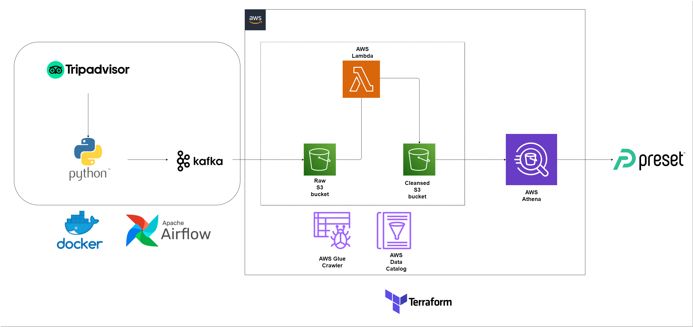
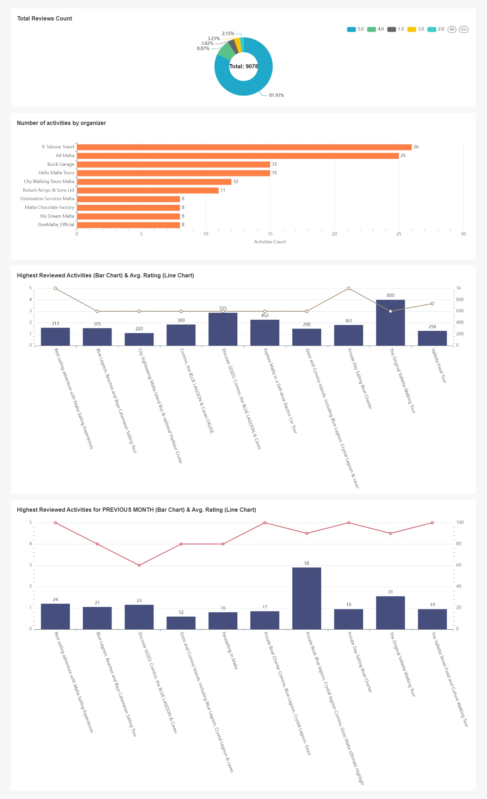

# **AWS End-to-End ELT Pipeline**

## **Architecture** 

  

## **Motivation** 

The aim of this project is to get familiar with popular data engineering services in AWS while also using tools such as Python, Docker, Kafka & Airflow to produce an ELT data pipeline.
A Preset Dashboard was also created to visualize the results from the project.

## **Summary**

This ELT project uses Airflow as an orchestration tool, packaged inside docker containers. The steps that make up the project is as follows:

1. The data was obtained from the [TripAdvisor activities for Malta](https://www.tripadvisor.com/Attractions-g190320-Activities-c42-Island_of_Malta.html) with kafka-python producer/consumer scripts. Web scraping best practices are used, such as; setting random sleep times, rotating user-agents and using the concurrent futures [ThreadPoolExecutor](https://docs.python.org/3/library/concurrent.futures.html#concurrent.futures.ThreadPoolExecutor), which uses a pool of threads to execute calls asynchronously.
2. The Kafka consumer dumps the raw data into a S3 bucket in JSON format using the [s3fs](https://pypi.org/project/s3fs/) module.
3. AWS Glue Crawler is used to populate the Data Catalog with tables.
4. A Lambda function makes a certain number of transformations to the data and also loads the cleansed data into another s3 bucket in [Parquet](https://parquet.apache.org/) format. 
5. Once transformations are completed the data is analyzed using Amazon Athena.
6. Preset is connected with Amazon Athena to produce a dashboard in order to visualize the data. For Preset-Athena connection a [connection URL](https://preset.io/blog/2021-5-25-data-lake-athena/) is needed.

*Note*: [Terraform](https://registry.terraform.io/providers/figma/aws-4-49-0/latest/docs) is used to create and manage all services related to AWS.

## **Tools & Technologies**

* *Containerization* - **Docker**, **Docker-Compose**
* *Infrastructure as Code* - **Terraform**
* *Message Queue* - **Kafka**
* *Orchestration* - **Airflow**
* *Data Storage* - **AWS S3**
* *Transformation* - **AWS Lambda**
* *Data Visualization* - **Preset**
* *Languages* - **Python, SQL**

## **Dashboard**

  

